# OpenTrader Architecture

```mermaid
%%{init: {'theme': 'dark', 'themeVariables': { 'primaryColor': '#1a1a2e', 'secondaryColor': '#16213e', 'tertiaryColor': '#0f3460', 'primaryTextColor': '#e0e0e0', 'lineColor': '#e94560'}}}%%

flowchart TB
    subgraph CLI["CLI / Entry Points"]
        RH["run_harness.py<br/>CLI args & config"]
        COORD["coordinator.py<br/>Multi-asset orchestration"]
    end

    subgraph EXCHANGE["Exchange Layer"]
        EX_ABC["ExchangeBase (ABC)<br/>get_bars / place_order / get_balance"]
        PAPER["PaperExchange<br/>Synthetic data + paper settlements"]
        LIVE["LiveExchange (CCXT)<br/>Real prices via Coinbase / Kraken<br/>Paper settlement"]
        WEB3["Web3Onchain<br/>Uniswap V3 swaps (Base Sepolia)"]
        EX_ABC --- PAPER
        EX_ABC --- LIVE
        EX_ABC --- WEB3
    end

    subgraph HARNESS["Harness — Main Event Loop"]
        H["OpenTraderHarness"]
        CYCLE["run_cycle()"]
        PROG["Progression System<br/>Stage 1→2→3 unlocks more symbols"]

        subgraph PHASE0["Phase 0: Pre-cycle"]
            CB["Circuit Breaker check<br/>(portfolio drawdown guard)"]
            SLTP["SL/TP Guardrails<br/>Stop-loss / Take-profit / Trailing / Timeout"]
            DAILY["Daily trade limit check"]
        end

        subgraph PHASE1["Phase 1: Signal Generation"]
            CONTEXT["Build AgentContext<br/>OHLCV + regime + economics<br/>news + arxiv + social + MTF"]
            DEBATE["Debate Engine<br/>LLM (Qwythos-9B) deliberates"]
            PARALLEL["Parallel debate<br/>One thread per symbol"]
        end

        subgraph PHASE2["Phase 2: Portfolio Optimization"]
            PORT_OPT["PortfolioOptimizer<br/>Correlation-aware Kelly allocation"]
            COMMITTEE["CommitteeChair<br/>Historical accuracy veto"]
        end

        subgraph PHASE3["Phase 3: Execution"]
            RISK_CHECK["RiskManager.check()<br/>Kelly sizing + exposure caps"]
            ORDER["Exchange.place_order()"]
            REBALANCE["Dynamic rebalance<br/>drift correction"]
        end

        subgraph PHASE4["Phase 4: Post-cycle"]
            RECORD["StateManager.write()"]
            FLASH["FlashTrainer.on_hold()"]
            REFLECT["ReflectionLog.record()"]
            PATTERN["RealTradePatternBank.extract()"]
            ARXIV_FEAT["arXiv feature extraction"]
            TRAIN_EVAL["TrainScheduler.evaluate()"]
            MOT_EVAL["MoT Coordinator evaluation"]
            ADAPTER["Adapter lifecycle check"]
        end

        H --> CYCLE
        CYCLE --> PHASE0
        PHASE0 --> PHASE1
        PHASE1 --> PHASE2
        PHASE2 --> PHASE3
        PHASE3 --> PHASE4
        PHASE4 -->|loop| CYCLE

        H --> PROG
    end

    subgraph DATA["Data Sources"]
        NEWS["News API<br/>Fear & Greed"]
        ARXIV["arXiv API<br/>q-fin papers → trading rules"]
        SOCIAL["Social sentiment<br/>Reddit, Twitter"]
        ECON["Economics MCP<br/>Economic indicators"]
        MTF["Multi-timeframe<br/>1h + 4h bars"]
    end

    subgraph RISK["Risk Management"]
        RM["RiskManager"]
        KELLY["Kelly sizing<br/>max_position_pct"]
        STOP_LOSS["Stop-loss / Take-profit<br/>Trailing stop"]
        MAX_EXP["Max exposure<br/>Portfolio stop"]
        REGIME_OV["Regime adaptation<br/>Market condition overrides"]
        PERFORMANCE["PerformanceAnalytics<br/>Sharpe, win rate"]
        PARAM_OPT["ParamOptimizer<br/>Portfolio-scale interpolation"]

        RM --> KELLY
        RM --> STOP_LOSS
        RM --> MAX_EXP
        RM --> REGIME_OV
        RM --> PERFORMANCE
        RM --> PARAM_OPT
    end

    subgraph MOT["Management of Trading (MoT)"]
        MOT_COORD["MoTCoordinator<br/>Evaluates every REVIEW_HOURS"]
        SCORER["AgentScorer<br/>Bull/Bear accuracy tracking"]
        REFLECTION["ReflectionLog<br/>Trade outcomes → learning signals"]
        ADAPTER_REG["AdapterRegistry<br/>LoRA adapter lifecycle"]
        FINETUNED["FineTunedAgent<br/>Loaded adapter for inference"]

        MOT_COORD -->|"increase / reduce / iterate"| RM
    end

    subgraph TRAINING["Training Pipeline"]
        FLASH_TRAIN["FlashTrainer<br/>Single-step training during HOLD"]
        FINETUNE["FinetuneCycle<br/>Subprocess: Unsloth + LoRA<br/>Qwen2.5-7B → Qwythos-9B"]
        SCHEDULER["TrainScheduler<br/>When to train vs. trade"]
        PATTERN_BANK["RealTradePatternBank<br/>Extract patterns from trades"]

        FINETUNE --> ADAPTER_REG
    end

    subgraph STATE["State Persistence"]
        ST_MGR["StateManager"]
        AGENT_STATE["agent_state.json<br/>Cycle, positions, signals"]
        PAPER_STATE["paper_state.json<br/>Portfolio, cash, fills"]
        HIGH_LEVEL["high_level_state.json<br/>Regime, posture"]
        TRAINING_DATA["training_data.jsonl<br/>Reflections → training examples"]

        ST_MGR --> AGENT_STATE
        ST_MGR --> PAPER_STATE
        ST_MGR --> HIGH_LEVEL
    end

    subgraph DASHBOARD["Dashboard"]
        DASH["FastAPI + HTMX<br/>Port 8097"]
        STATE_READER["StateReader<br/>Reads JSON files"]
        CHARTS["Equity curve, drawdown<br/>Positions, signals, accuracy"]
        DASH --> STATE_READER
    end

    subgraph LLM["LLM Inference"]
        LLAMA_SERVER["llama-server (port 5809)<br/>Qwythos-9B Q4_K_M<br/>Direct connection"]
        LLAMA_SWAP["llama-swap (port 8080)<br/>Routing proxy<br/>⚠️ NOT used for harness"]
    end

    subgraph EXTERNAL["External Services"]
        COINBASE["Coinbase / Kraken<br/>CCXT market data"]
        UNISWAP["Uniswap V3 (Base Sepolia)<br/>On-chain swaps"]
    end

    %% Connections
    RH --> HARNESS
    COORD -->|spawns| HARNESS

    HARNESS --> EXCHANGE
    EXCHANGE --> EXTERNAL

    HARNESS --> DATA

    HARNESS --> RISK
    HARNESS --> MOT
    HARNESS --> TRAINING
    HARNESS --> STATE
    HARNESS --> LLM

    DATA --> HARNESS

    DASHBOARD --> STATE

    LLAMA_SERVER --> HARNESS
    LLAMA_SWAP -.-x|"× Not used"| HARNESS

    %% Styling
    classDef exchange fill:#1a3a2e,stroke:#4caf50
    classDef harness fill:#1a1a4e,stroke:#536dfe
    classDef risk fill:#3e1a1a,stroke:#f44336
    classDef mot fill:#2e1a4e,stroke:#9c27b0
    classDef training fill:#1a1a3e,stroke:#2196f3
    classDef state fill:#1a2e1a,stroke:#4caf50
    classDef data fill:#2e2e1a,stroke:#ffeb3b
    classDef llm fill:#3e2e1a,stroke:#ff9800
    classDef dashboard fill:#1a2e3e,stroke:#00bcd4
    classDef external fill:#2e1a1a,stroke:#ff5722

    class EX_ABC,PAPER,LIVE,WEB3 exchange
    class H,CYCLE,PHASE0,PHASE1,PHASE2,PHASE3,PHASE4,PROG harness
    class RM,KELLY,STOP_LOSS,MAX_EXP,REGIME_OV,PERFORMANCE,PARAM_OPT risk
    class MOT_COORD,SCORER,REFLECTION,ADAPTER_REG,FINETUNED mot
    class FLASH_TRAIN,FINETUNE,SCHEDULER,PATTERN_BANK training
    class ST_MGR,AGENT_STATE,PAPER_STATE,HIGH_LEVEL state
    class NEWS,ARXIV,SOCIAL,ECON,MTF data
    class LLAMA_SERVER,LLAMA_SWAP llm
    class DASH,STATE_READER,CHARTS dashboard
    class COINBASE,UNISWAP external
```



## Cycle Flow (detailed)

```
[Start] → Push bars → Check SL/TP → Circuit breaker? → Daily limit?
    │
    ▼
┌─────────────────────────────────────────────────────────────┐
│ Phase 1: Signal Generation (per symbol, in parallel)        │
│  1. Build AgentContext (OHLCV + regime + economics + news)  │
│  2. LLM debate (Bull/Bear/Risk deliberation)                │
│  3. Record signal                                           │
└─────────────────────────────────────────────────────────────┘
    │
    ▼
┌─────────────────────────────────────────────────────────────┐
│ Phase 1.5: Log ALL signals to history                       │
└─────────────────────────────────────────────────────────────┘
    │
    ▼
┌─────────────────────────────────────────────────────────────┐
│ Phase 2: Portfolio Optimization                             │
│  1. Compute correlation matrix                              │
│  2. Correlation-aware Kelly allocation                      │
│  3. Committee review (historical accuracy veto)             │
└─────────────────────────────────────────────────────────────┘
    │
    ▼
┌─────────────────────────────────────────────────────────────┐
│ Phase 3: Execution (per symbol)                             │
│  1. RiskManager.check() - position sizing                   │
│  2. Regime overrides applied                                │
│  3. Exchange.place_order()                                  │
│  4. Set SL/TP levels if BUY                                 │
│  5. Record trade to journal if SELL                         │
└─────────────────────────────────────────────────────────────┘
    │
    ▼
┌─────────────────────────────────────────────────────────────┐
│ Phase 4: Post-cycle                                         │
│  1. FlashTrain (if HOLD streak)                             │
│  2. ReflectionLog.record()                                  │
│  3. StateManager.write() + agent_state.json                 │
│  4. Pattern extraction (every 10 cycles)                    │
│  5. arXiv feature extraction (every 50 cycles)              │
│  6. Training scheduler eval (every 50 cycles)               │
│  7. MoT evaluation (every REVIEW_HOURS)                     │
│  8. Adapter lifecycle check                                 │
└─────────────────────────────────────────────────────────────┘
    │
    ▼
[Sleep cycle_interval] ───→ [Next cycle]
```

## Key Design Decisions

| Decision | Rationale |
|----------|-----------|
| **Sync-only** | No asyncio. Threads for I/O (parallel debate per symbol); GIL protects shared state |
| **Paper settlement always** | Exchange provides real prices, but settlement is always paper — no real funds at risk |
| **Direct llama-server** | Bypass llama-swap (port 8080) for latency. Harness connects to port 5809 directly |
| **State on disk** | Every cycle writes JSON files. Survives crashes, restartable. Dashboard reads same files |
| **Training as subprocess** | Fine-tuning launched as subprocess so it doesn't block the trading loop |
| **Flash training in-process** | Lightweight single-step training during HOLD — no separate process needed |
| **Debate modes** | `fast` (single composite LLM call with Bull/Bear/Risk roles) or `adir` (independent agents) |
| **Staged progression** | Starts with BTC only, graduates to more symbols after proving profitability |
| **MoT meta-controller** | Periodically evaluates performance and adjusts risk posture (increase/reduce/iterate) |

## Progression Stages

| Stage | Symbols | Unlock Hours | Unlock Return |
|-------|---------|-------------|---------------|
| 1 | BTC/USDT | 6h | +1% |
| 2 | BTC/USDT, ETH/USDT, SOL/USDT | 24h | +5% |
| 3 | + AAPL, NVDA, SONY (equities) | 48h | +10% |

## Port Map

| Port | Service |
|------|---------|
| 5809 | llama-server (Qwythos-9B, direct — harness uses this) |
| 8080 | llama-swap (routing proxy — NOT for harness) |
| 8092 | MCP server (economics, state tools) |
| 8097 | Dashboard (no `--reload` flag) |

## File Layout

```
opentrader/
├── harness.py              # Main event loop
├── coordinator.py          # Multi-asset deployment
├── dashboard.py            # FastAPI + HTMX dashboard
├── run_harness.py          # CLI entry point
├── benchmark_models.py     # Model comparison
├── exchange/
│   ├── base.py             # ExchangeBase ABC
│   ├── paper.py            # Paper/synthetic exchange
│   └── live.py             # CCXT live exchange
├── agent/
│   ├── base.py             # BaseAgent + Signal + AgentContext
│   ├── trading_agent.py    # LLM-backed agent
│   └── mcp_client.py       # MCP tool client
├── risk/
│   ├── manager.py          # RiskManager: sizing, SL/TP, circuit breaker
│   ├── portfolio_optimizer.py # Correlation-aware Kelly allocation
│   ├── regime_adaptation.py   # Market-condition overrides
│   ├── param_optimizer.py     # Portfolio-scale parameter interpolation
│   └── performance_analytics.py # Sharpe, win rate, metrics
├── state/
│   └── manager.py          # JSON persistence layer
├── mot/
│   ├── coordinator.py      # MoT periodic evaluation
│   ├── monitors.py         # CommitteeChair (per-trade veto)
│   ├── scoring.py          # AgentScorer (Bull/Bear accuracy)
│   ├── reflection.py       # ReflectionLog (outcome tracking)
│   ├── adapter_registry.py # LoRA adapter lifecycle
│   ├── finetuned_agent.py  # Loaded adapter for inference
│   └── agents/             # debate engines (fast_debate, adir_debate)
├── data/                   # JSON state files, training data
│   ├── news.py
│   ├── arxiv.py
│   ├── social_sentiment.py
│   ├── synthetic.py
│   ├── regime_classifier.py
│   └── feature_integrator.py
├── training/
│   ├── flash_train.py      # In-process light training
│   ├── finetune_cycle.py   # Full LoRA fine-tune subprocess
│   ├── train_scheduler.py  # Train-or-trade decision engine
│   ├── real_pattern_bank.py # Pattern extraction from trades
│   ├── data_builder.py     # Build training examples
│   └── run_training.py     # Training entry point
├── scripts/                # Deploy/restart scripts
├── models/                 # Finetuned adapters
├── charts/                 # Chart outputs
└── logs/                   # Log files
```
