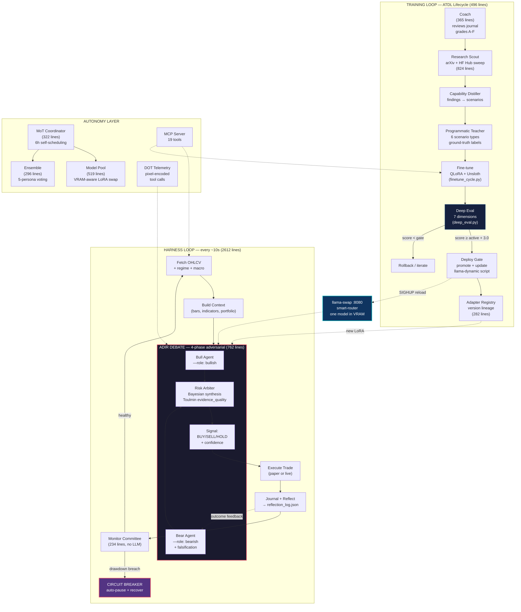

# OpenTrader Agentic Loop

> **HARNESS** runs every ~10s | **TRAINING** runs daily via cron | **DEPLOY** gates on deep_eval score  

## Key Loops

| Loop | What drives it | Cadence | Key module |
|------|---------------|---------|------------|
| **Harness** | Market data fetch | ~10s per cycle | `harness.py` (2612 lines) |
| **ADIR Debate** | Each harness cycle | 4 LLM calls/cycle | `mot/agents/adir_debate.py` (762) |
| **Training** | Coach grade + data growth | ~daily (cron 02:00) | `finetune_cycle.py` + `train_pipeline.sh` |
| **Deep Eval** | New untested candidate | Post-train (04:00+12:00) | `deep_eval.py` (893) |
| **Deploy** | Eval score ≥ active + 3.0 | Post-eval (08:00) | `deploy_gate.sh` (141) |
| **Research** | Harness idle detection | Opportunistic | `research_runner.py` (824) |

## How ADIR Debate Works

Each harness cycle runs a 4-phase adversarial debate:

1. **Bull Agent** — prompted with bullish role, argues for BUY
2. **Bear Agent** — prompted with bearish role, argues for SELL + **falsification** (finds counter-evidence to Bull)
3. **Confidence Gate** — both agents self-rate their conviction
4. **Risk Arbiter** — Bayesian synthesis using Toulmin argumentation, weights by `evidence_quality`

Output: `Signal(action, confidence, position_pct)` with debate trace like `Bull(BUY,65%,evq=0.58) vs Bear(SELL,76%,evq=0.35) → RISK(SELL,20%)`

## Deep Eval — 7 Dimensions

Each candidate model is scored on:

| # | Dimension | Weight | Method |
|---|-----------|--------|--------|
| 1 | Signal Accuracy | 0.25 | 200 scenarios → direction-match vs ground_truth |
| 2 | Reasoning Coherence | 0.20 | Parses cited RSI/MACD/MA → recomputes from bars → checks accuracy |
| 3 | Confidence Calibration | 0.20 | Binned (predicted, actual) pairs → ECE calibration error |
| 4 | Adversarial Robustness | 0.15 | ±5% Gaussian noise + 3-bar contradiction → flip rate |
| 5 | Debate Quality (ADIR) | 0.10 | Bull↔BUY + Bear↔SELL alignment → Risk arbiter sanity |
| 6 | Edge Detection | 0.05 | HOLD rate in ranging vs ACTIVE rate in trending |
| 7 | Temporal Consistency | 0.05 | Identical input queried twice → agreement rate |

Score = weighted sum × 100. Candidate must beat active by ≥ 3 points to deploy.

## Constraint

**16GB VRAM (RX 7900 XT)** → one 7B model loaded at a time. All agent roles (Bull, Bear, Risk, Research, Coach) are the same base model + active LoRA, queried with different system prompts. Training and inference are serialized — harness pauses during fine-tuning and deep_eval runs.
