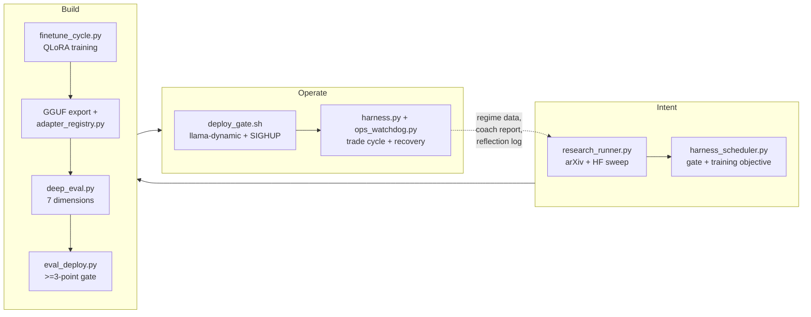

# OpenTrader — Agentic SDLC Mapping

OpenTrader is an autonomous trading-agent harness that trains, evaluates, and deploys LoRA adapters on a 16GB AMD RX 7900 XT (ROCm 7.2). Its lifecycle maps cleanly onto the [Agentic SDLC Handbook](https://google.com/search?q=Agentic+SDLC+Handbook+Daniel+Meppiel) 8-phase framework (Ideate -> Plan -> Code -> Build -> Test -> Review -> Release -> Operate), grouped into three buckets: Intent, Build, and Operate.

Prior to Jul 16, the Operate phase was unsupervised — a stuck eval lock froze the harness via SIGSTOP for 36 hours, the ATDL research scout (harness_scheduler.py) was un-cronned and dead, and there was no watchdog. The new `ops_watchdog.py` closes the Operate gap with automated detection and recovery for common failure modes.

---

## Full-Cycle Flowchart

---

## Phase Gate Table

| Phase | Entry criteria | Exit signal | Rollback trigger | Module |
|-------|---------------|-------------|-----------------|--------|
| **Ideate** | harness idle (no training.lock) | capability manifest with >=50 cumulative scenarios | manifest score < 3 actionable findings | `research_runner.py` |
| **Plan** | manifest exists | training objective JSON written | coach grade = F -> re-plan | `harness_scheduler.py` |
| **Code** | objective + delta >= 20 new examples | LoRA checkpoint + loss < threshold | training crash / loss diverges | `finetune_cycle.py` |
| **Build** | checkpoints exist | GGUF exported + registered (base_model+gguf_path) | GGUF export fails -> lower LoRA rank | `adapter_registry.py` |
| **Test** | GGUF + base_model in registry | deep_eval score >= 0.5, all 7 dims non-zero | eval crash -> watchdog retries | `deep_eval.py` |
| **Review** | deep eval report exists | candidate score >= active + 3.0 | all candidates scored, no promotion | `eval_deploy.py` |
| **Release** | promotion approved | llama-dynamic updated + SIGHUP + health check | health fails -> previous_version | `deploy_gate.sh` |
| **Operate** | harness running + model loaded | portfolio cycling, breaker not tripped | drawdown > threshold -> circuit breaker | `harness.py`, `ops_watchdog.py` |

---

## 5-Layer Architecture Mapping

| Layer | SDLC Handbook Definition | OpenTrader Implementation |
|-------|-------------------------|--------------------------|
| **Layer 5: Platform** | Git, CI/CD, dashboards, monitoring | cron pipeline, `dashboard.py:8098`, `tui_dashboard.py`, `ops_watchdog.py` |
| **Layer 4: Context & Capabilities** | System prompts, memory, tool catalogs | `harness_config.json`, SYSTEM_PROMPT in `trading_agent.py:243`, ADIR role prompts in `adir_debate.py`, `mot/reflection.py` |
| **Layer 3: Governance & Distribution** | Version lineage, approval gates, rollback | `adapter_registry.json` (version lineage, eval_score), `eval_deploy.py` (>=3.0 gate), `coordinator.py::should_promote()` (eval_score > 0) |
| **Layer 2: Agent Harness (runtime)** | Inference, debate, execution loop | llama-server + llama-swap :8080, `harness.py` loop |
| **Layer 1: SDLC Phases** | The 8 phases of the development lifecycle | See phase gate table above |

---

## Maturity Assessment

| Phase | Maturity | Notes |
|-------|----------|-------|
| Ideate | Yellow (Emerging) | Research scout runs, but only via cron every 12h — not continuous |
| Plan | Yellow (Emerging) | Training objectives generated, but coach->plan link is brittle |
| Code | Green (Now) | QLoRA fine-tuning via Unsloth, batch-1 grad-accum-4, epoch-1 |
| Build | Green (Now) | GGUF export + adapter_registry with base_model/gguf_path fields |
| Test | Yellow (Emerging) | 7-dim DeepEval but dim2 reasoning_coherence ~0.5 (needs prompt fix) |
| Review | Green (Now) | >=3.0 deploy gate, eval_score > 0 coordinator check |
| Release | Yellow (Emerging) | Deploy gate works, but chained-only from eval — no standalone cron |
| **Operate** | **Red (Directional)** | Directional industry-wide; `ops_watchdog.py` is our incident response |

---

## Operate-Phase Reliability

The watchdog addresses 6 specific failure modes:

| Failure | Detection | Recovery | Log |
|---------|-----------|----------|-----|
| Stale flock lock | `fuser` + mtime > 2h | `rm -f` the lockfile | `watchdog.log` |
| SIGSTOP'd harness | `/proc/{pid}/status` State: T | `kill -SIGCONT {pid}` | `watchdog.log` |
| Dead harness | `pgrep -f harness.py` empty | `setsid` restart from `harness_cmd.txt` | `watchdog.log`, `harness.log` |
| Stale scheduler | `scheduler_state.json` mtime > 12h | `harness_scheduler auto` subprocess | `scheduler_cron.log` |
| Orphaned eval server | `llama-server :5805` running without `eval_gate.sh` | `kill -9 {pid}` | `watchdog.log` |
| Missing visibility | No health file | `health.json` written every 5 min | `data/health.json` |

Additionally, `eval_gate.sh` now has a `trap EXIT INT TERM` that ensures the harness is SIGCONT'd even if eval crashes mid-run (the 36h frozen-harness class of bug is now eliminated).

---

## Feedback Loop

The watcher + scheduler + coach close the autonomous improvement loop. The harness generates regime data + a reflection log (`mot/reflection.py`, 118 lines) that persists debate->outcome memory (each closed position records the decision, reasoning, profit/loss, and counterfactual). The coach (`mot/coach.py`) ingests regime data + reflections and assigns grades. The research scout (`harness_scheduler.py`) reads coach reports + market regime data, sweeps arXiv/HuggingFace for new findings, generates training objectives. The Plan phase produces a training objective, triggering a new model. Eval scores the candidate. The deploy gate promotes if the score beats the active model by >=3.0. The new model enters the harness, generating more regime data — closing the loop.
